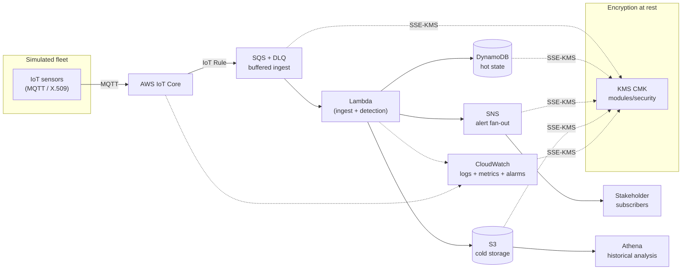

# PyroSense 🔥

> Serverless, event-driven platform for **early wildfire detection** and
> **multi-stakeholder alerting**, built on AWS with 100% Infrastructure as Code.

**Status:** 🚧 Active development — building the `v1.0-serverless` MVP.
The ingest core (Python Lambda) is complete and fully tested; infrastructure
wiring is in progress — the FinOps guardrail is deployed, the pipeline
encryption key has been verified in a deploy/destroy cycle, and the SQS
messaging module is code complete and pending deployment.

---

## Context

Bogotá's *Cerros Orientales* burned during the January 2024 wildfire season,
exposing gaps in how emergency and environmental agencies detect and coordinate
around early-stage fires. PyroSense is a portfolio-grade reference platform that
explores how a serverless, event-driven architecture on AWS could ingest sensor
telemetry, run detection logic in the cloud, and fan out alerts to the relevant
institutional stakeholders (e.g. Bomberos Bogotá, IDIGER, SDA, CAR, EAAB).

> **Not a production system.** Devices are simulated (no physical hardware).
> This repository is an engineering artifact designed to demonstrate cloud
> architecture, IaC and DevOps practices end to end.

---

## What it does (target flow)

A simulated IoT sensor fleet publishes environmental telemetry. The cloud —
not the sensor — decides what constitutes a fire condition, correlates signals,
and dispatches alerts to subscribed stakeholders while persisting history for
later analysis.

> **Design principle:** sensors *report conditions*, they do not *make
> decisions*. Alert logic lives in the cloud.

---

## Reference architecture



> The diagram reflects the **target** design; components are added to this repo
> path by path. See the roadmap for current build status.

> Encryption arrows point **toward** KMS because that is the direction of the
> calls: each service requests a data key from KMS on the caller's behalf. This
> is why a consuming role needs `kms:GenerateDataKey` and `kms:Decrypt` in its
> own IAM policy even though the application code never mentions KMS. IoT Core
> is absent from that group on purpose — its message broker does not persist
> messages, so there is nothing at rest to encrypt. (ADR-0010)

---

## Tech stack

| Layer                | Choice                                                       |
| -------------------- | ----------------------------------------------------------- |
| Ingestion            | AWS IoT Core (MQTT, X.509 mutual TLS)                       |
| Buffering            | Amazon SQS standard queue (+ DLQ), SSE-KMS, partial batch responses |
| Compute              | AWS Lambda (Python 3.12)                                    |
| Hot state            | Amazon DynamoDB (single-table, TTL)                        |
| Alerting             | Amazon SNS                                                  |
| Cold storage / query | Amazon S3 + Amazon Athena                                  |
| Observability        | Amazon CloudWatch (structured logs, EMF metrics, alarms)   |
| IaC                  | Terraform (remote S3 backend, native state locking)        |
| CI/CD                | GitHub Actions                                              |
| Quality gate         | `terraform fmt/validate`, tflint, trivy, gitleaks, ruff, mypy, pytest (≥90% coverage) |

---

## Demo vs. Production (ADR-0002)

> **"Design for production, deploy for demo."**

The architecture is designed and cost-modeled at production scale, but deployed
ephemerally at near-zero cost. Terraform is parametrized (`demo` / `prod` via
`.tfvars`) and the cost model is documented in two columns — *demo actual* vs.
*production projected* — so ambition is never traded away for budget.

---

## Repository structure

```text
.
├── README.md
├── Makefile                 # task shortcuts (test, lint, plan, apply)
├── pyproject.toml           # Python tooling config (ruff, mypy, pytest, coverage)
├── trivy.yaml               # scanner config (shared by local runs and CI)
├── .tflint.hcl              # lint ruleset
├── main.tf outputs.tf variables.tf versions.tf providers.tf
├── demo.tfvars prod.tfvars  # per-environment inputs (examples committed)
├── bootstrap/               # one-time remote backend (S3 state) setup
├── config/                  # backend / shared configuration
├── docs/
│   ├── adr/                 # Architecture Decision Records
│   └── evidence/            # evidence for destroyed resources
├── modules/                 # reusable Terraform modules (AWS infra)
│   ├── budgets/             # account-wide FinOps guardrail
│   ├── security/            # pipeline KMS key + key policy
│   └── messaging/           # SQS ingest queue + DLQ (see its README)
├── scripts/                 # helper scripts
├── src/
│   └── ingest_lambda/       # Python 3.12 Lambda source (see its README)
├── tests/                   # pytest suite for the Lambda (see its README)
└── .github/workflows/       # CI/CD pipelines
```

---

## Getting started

**Prerequisites**

- AWS account with programmatic access
- AWS CLI ≥ 2.32.0 (uses `aws login` for temporary, auto-refreshing credentials)
- Terraform ≥ 1.11 (native S3 state locking via `use_lockfile = true`)
- **Python 3.12** (the Lambda runtime target — the test suite requires 3.12+)
- Quality gate tooling: `tflint`, `trivy`, `pre-commit`, and `jq` (used to
  inspect the JSON plan before apply)

**Run the Lambda test suite**

```bash
python3.12 -m venv .venv && source .venv/bin/activate
pip install -r requirements-dev.txt
pytest              # 91 tests, ≥90% coverage
```

> The suite runs entirely against an in-memory AWS (moto): no account, no
> credentials, no cost. See `tests/README.md`.

**Deploy the infrastructure**

The backend bucket is created once by `bootstrap/state-backend` — see that
directory's README. Once `config/backend.hcl` exists:

```bash
terraform init -backend-config=config/backend.hcl
make check                                          # the full static gate
terraform plan -var-file=demo.tfvars -out=tfplan
terraform apply tfplan
```

> Re-run `terraform init` whenever a new module block is added to `main.tf`.

> Inspect the plan before applying. A green static gate does not prove the plan
> contains what you expect — verify the artifact itself:
>
> ```bash
> terraform show -json tfplan | jq -r '.resource_changes[].address'
> ```

---

## Roadmap & status

PyroSense is built in phased stages toward `v1.0-serverless`. Detection → alerting
is prioritized over cold storage to ship the core value slice first. Live status
is tracked in the project log.

| Area                             | Status |
| -------------------------------- | ------ |
| Ingest core (Python Lambda)      | ✅ Complete, tested (91 tests, ~99% coverage) |
| CI quality gate (Actions)        | ✅ Lint + types + tests on every push |
| Remote state backend             | ✅ Deployed |
| FinOps guardrail (budgets)       | ✅ Deployed |
| Encryption key (KMS)             | ✅ Verified in a deploy/destroy cycle |
| Messaging (SQS + DLQ)            | ✅ Verified in a deploy/destroy cycle |
| Storage (DynamoDB / S3 / Athena) | ⬜ Planned |
| Alerting (SNS) end to end        | ⬜ Planned |
| IoT Core rule → Lambda           | ⬜ Planned |
| Observability (alarms, dashboard)| ⬜ Planned |
| Terraform CI workflow + OIDC     | ⬜ Planned |

---

## Design decisions

Significant decisions are documented as ADRs under `docs/adr/`. Current set:

| # | Decision |
|---|---|
| 0001 | Remote state on S3 with native lockfile locking |
| 0002 | Design for production, deploy for demo |
| 0003 | Account-wide monthly budget as the FinOps guardrail |
| 0004 | Lint tags at the provider, not per resource |
| 0005 | Alert suppression: race-free slot, claimed before publishing |
| 0006 | Contract-first re-validation at the consumer boundary |
| 0007 | Dependency-free Lambda (standard library only) |
| 0008 | At-least-once delivery handled by idempotent conditional writes |
| 0009 | Observability: JSON logs on stderr, EMF metrics on stdout |
| 0010 | A single customer-managed KMS key for the whole pipeline |
| 0011 | Ingest buffer retry contract: consumer-derived visibility timeout, DLQ outlives its source |
| 0012 | Permanent (contract) failures stay on the SQS retry path |

---

## License

For license information check the LICENSE file.
