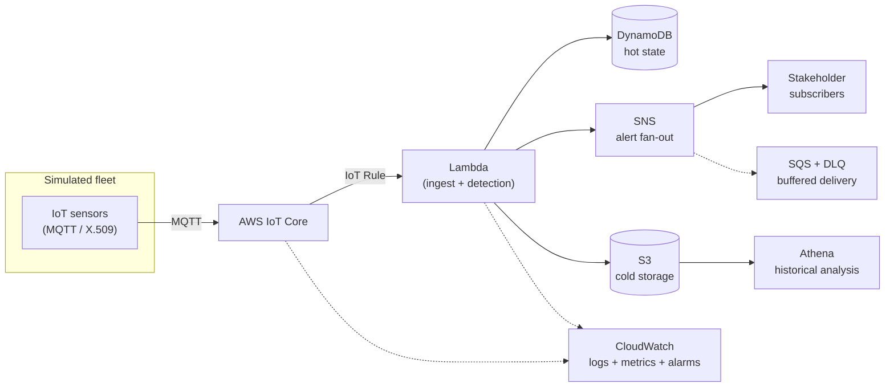

# PyroSense 🔥

> Serverless, event-driven platform for **early wildfire detection** and
> **multi-stakeholder alerting**, built on AWS with 100% Infrastructure as Code.

**Status:** 🚧 Active development — building the `v1.0-serverless` MVP.

---

## Context

Bogotá's *Cerros Orientales* burned during the January 2024 wildfire season,
exposing gaps in how emergency and environmental agencies detect and coordinate
around early-stage fires. PyroSense is a portfolio-grade reference platform that
explores how a serverless, event-driven architecture on AWS could ingest sensor
telemetry, run detection logic in the cloud, and fan out alerts to the relevant
institutional stakeholders (e.g. Bomberos Bogotá, IDIGER, SDA, CAR, EAAB).

> **Not a production system.** Devices are simulated (no physical hardware).
> This repository is an engineering artifact designed to demonstrate cloud
> architecture, IaC and DevOps practices end to end.

---

## What it does (target flow)

A simulated IoT sensor fleet publishes environmental telemetry. The cloud —
not the sensor — decides what constitutes a fire condition, correlates signals,
and dispatches alerts to subscribed stakeholders while persisting history for
later analysis.

> **Design principle:** sensors *report conditions*, they do not *make
> decisions*. Alert logic lives in the cloud.

---

## Reference architecture



> The diagram reflects the **target** design; components are added to this repo
> path by path. See the roadmap for current build status.

---

## Tech stack

| Layer               | Choice                                                        |
| ------------------- | ------------------------------------------------------------ |
| Ingestion           | AWS IoT Core (MQTT, X.509 mutual TLS)                         |
| Compute             | AWS Lambda (Python 3.12)                                      |
| Hot state           | Amazon DynamoDB                                               |
| Alerting            | Amazon SNS + SQS (+ DLQ)                                      |
| Cold storage / query| Amazon S3 + Amazon Athena                                     |
| Observability       | Amazon CloudWatch (logs, metrics, alarms)                    |
| IaC                 | Terraform (remote S3 backend, native state locking)          |
| CI/CD               | GitHub Actions                                                |
| Quality gate        | `terraform fmt/validate`, tflint, tfsec, gitleaks, ruff, mypy, pytest |

---

## Demo vs. Production (ADR-007)

> **"Design for production, deploy for demo."**

The architecture is designed and cost-modeled at production scale, but deployed
ephemerally at near-zero cost. Terraform is parametrized (`demo` / `production`
mode) and the cost model is documented in two columns — *demo actual* vs.
*production projected* — so ambition is never traded away for budget.

---

## Repository structure (evolving)

```text
.
├── README.md
├── .gitignore
├── docs/            # ADRs, diagrams, cost model
├── modules/         # reusable Terraform modules
├── envs/            # per-environment root configs (demo / production)
├── lambdas/         # Python 3.12 Lambda source + tests
└── .github/         # CI/CD workflows
```

---

## Getting started

**Prerequisites**

- AWS account with programmatic access
- AWS CLI ≥ 2.32.0 (uses `aws login` for temporary, auto-refreshing credentials)
- Terraform ≥ 1.11 (native S3 state locking via `use_lockfile = true`)
- Python 3.12

Detailed setup lands here as the infrastructure is built out.

---

## Roadmap & status

PyroSense is built in phased stages toward `v1.0-serverless`. Detection → alerting
is prioritized over cold storage to ship the core value slice first. Live status
is tracked in the project log.

---

## Design decisions

Significant decisions are documented as ADRs under `docs/`. Highlights:

- **ADR-007** — Design for production, deploy for demo.
- **ADR-010** — Terraform-native S3 state locking (`use_lockfile = true`).

---

## License

For license information check the LICENSE file.
