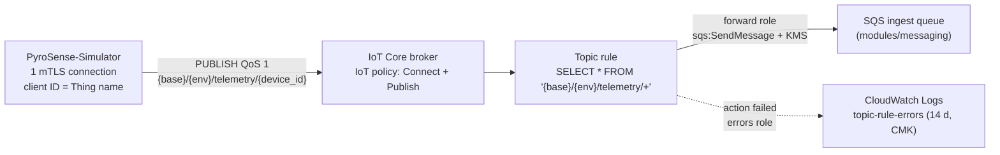

# modules/iot

The system boundary of PyroSense: who may speak MQTT to AWS IoT Core, and
where each telemetry message goes once it arrives.



## What it creates

| Resource | Why |
|---|---|
| `aws_iot_thing.fleet_client` | The one MQTT identity of the fleet client. Its name is the only client ID the policy accepts. |
| `aws_iot_certificate.fleet_client` | X.509 certificate issued **from a CSR**. The private key never reaches Terraform (ADR-0017). |
| `aws_iot_thing_principal_attachment.fleet_client` | Binds the certificate to the Thing, `EXCLUSIVE_THING`. |
| `aws_iot_policy.fleet_client` + `aws_iot_policy_attachment.fleet_client` | Connect as the Thing name, publish only to this environment's telemetry topics (ADR-0016). |
| `aws_iam_role.forward` + inline policy | The rule's SQS action: `sqs:SendMessage` + `kms:GenerateDataKey`/`kms:Decrypt`. |
| `aws_iam_role.errors` + inline policy | The rule's error action. A separate identity, so a broken forwarding policy cannot silence the error path (ADR-0018). |
| `aws_cloudwatch_log_group.rule_errors` | Destination of the rule's error documents. 14-day retention, pipeline CMK. |
| `aws_iot_topic_rule.telemetry` | `SELECT *` with no WHERE → SQS; `error_action` → CloudWatch Logs. |
| `data.aws_iot_endpoint.data_ats` | The `iot:Data-ATS` endpoint the simulator connects to. |

**Not created here:** account-level IoT logging (`aws_iot_logging_options`).
The provider's delete is a no-op, so destroying this module every demo cycle
would leave account logging enabled and pointing at a deleted role. It
belongs to a persistent layer (see "Not verified / deferred").

## Inputs

| Name | Type | Validation | Source in the root |
|---|---|---|---|
| `name_prefix` | string | `^[a-z0-9-]{1,64}$` | `local.name_prefix` |
| `topic_base` | string | one topic level, `^[a-z0-9-]{1,64}$` | project identifier (see `ROOT-CHANGES-iot.md`) |
| `environment` | string | one topic level, `^[a-z0-9-]{1,64}$` | `var.environment` |
| `queue_arn` | string | standard SQS ARN | `module.messaging.queue_arn` |
| `queue_url` | string | `https://`, not `.fifo` | `module.messaging.queue_url` |
| `kms_key_arn` | string | KMS key ARN, not an alias | `module.security.kms_key_arn` |
| `fleet_client_csr_pem` | string | PEM CSR, ≤ 4096 characters | `file()` of a CSR path set in the gitignored tfvars |

The topic-segment validations exclude `$` (reserved topics), `+`, `#` and
`/`. They also bound the longest topic to 152 bytes with 3 slashes, well
inside the service limits (256 bytes, 7 slashes).

## Outputs and consumers

| Output | Consumer |
|---|---|
| `iot_data_endpoint` | simulator (`PYROSENSE_IOT_ENDPOINT`), runtime DoD |
| `fleet_client_id` | simulator (`PYROSENSE_CLIENT_ID`) |
| `fleet_client_certificate_id`, `fleet_client_certificate_arn` | runbook / CLI checks |
| `fleet_client_certificate_pem` (sensitive) | runbook: written to the simulator's `PYROSENSE_CERT_PATH` |
| `fleet_client_policy_name` | CLI checks |
| `telemetry_topic_filter` | docs, CLI checks |
| `topic_rule_name`, `topic_rule_arn` | `modules/observability` (`RuleName` dimension) |
| `rule_error_log_group_name` | `modules/observability`, triage |
| `simulator_env` | simulator `.env` (endpoint, topic base, env, client ID) |

## IAM contract

| Principal | Permissions | Scope |
|---|---|---|
| Fleet client certificate (IoT policy) | `iot:Connect` | `client/${iot:Connection.Thing.ThingName}` if `iot:Connection.Thing.IsAttached` |
| | `iot:Publish` | `topic/{base}/{env}/telemetry/PYRO-T?-????` if `IsAttached` |
| Forward role (trust: `iot.amazonaws.com`, `aws:SourceAccount` + `aws:SourceArn` = this rule) | `sqs:SendMessage` | ingest queue ARN |
| | `kms:GenerateDataKey`, `kms:Decrypt` | pipeline CMK, through `EnableIAMDelegation` (no key-policy change) |
| Errors role (same trust) | `logs:CreateLogStream`, `logs:DescribeLogStreams`, `logs:PutLogEvents` | error log group and its streams |
| CloudWatch Logs service | CMK use for the error log group | existing `AllowCloudWatchLogs` key-policy statement (first real use) |

Not granted, on purpose: `iot:Subscribe`, `iot:Receive` (the simulator never
subscribes) and `iot:RetainPublish`.

## Contract with PyroSense-Simulator

| Setting (`MqttSettings`, prefix `PYROSENSE_`) | Value | Source |
|---|---|---|
| `IOT_ENDPOINT` | host name only, e.g. `xxxx-ats.iot.us-east-1.amazonaws.com` | `simulator_env` |
| `TOPIC_BASE`, `ENV` | `{base}`, `{env}` of this environment | `simulator_env` |
| `CLIENT_ID` | Thing name, e.g. `pyrosense-demo-fleet-client` | `simulator_env` |
| `CERT_PATH` | certificate PEM | `terraform output -raw fleet_client_certificate_pem` |
| `PRIVATE_KEY_PATH` | key generated locally (runbook step 2) | never Terraform |
| `ROOT_CA_PATH` | Amazon Root CA 1 (RSA 2048, matches the ATS endpoint) | runbook step 3 |

The simulator's own defaults (`env = "dev"`, `client_id =
"pyrosense-fleet-sim"`) match no environment of this project. Always load
`simulator_env`. A missing value fails loudly: `Connect.AuthError` or
`PublishIn.AuthError`, never a silent loss.

## Certificate runbook (fleet client)

The private key is created and kept **outside both repositories**, in a
directory with owner-only permissions. It is never an input to Terraform.

```bash
# 1. Key directory, owner-only (one per environment)
mkdir -p ~/.config/pyrosense/certs/demo
chmod 700 ~/.config/pyrosense/certs ~/.config/pyrosense/certs/demo
cd ~/.config/pyrosense/certs/demo

# 2. Private key + CSR. RSA 2048 is an accepted key type for CreateCertificateFromCsr.
openssl req -new -newkey rsa:2048 -nodes \
  -keyout fleet-client.private.pem.key \
  -out fleet-client.csr \
  -subj "/CN=pyrosense-demo-fleet-client"
chmod 600 fleet-client.private.pem.key

# 3. Amazon Root CA 1 (trust anchor of the iot:Data-ATS endpoint)
curl -sS -o AmazonRootCA1.pem https://www.amazontrust.com/repository/AmazonRootCA1.pem

# 4. Point the gitignored demo.tfvars at the CSR (root variable, see ROOT-CHANGES-iot.md),
#    then plan/apply from the root.

# 5. After apply (run from the infrastructure repo root): certificate + simulator env
#    (root output names as proposed in ROOT-CHANGES-iot.md)
terraform output -raw iot_fleet_client_certificate_pem > ~/.config/pyrosense/certs/demo/fleet-client.pem.crt
terraform output -json iot_simulator_env | jq -r 'to_entries[] | "\(.key)=\(.value)"'
```

Add the four printed lines, plus the three `*_PATH` variables pointing at
`~/.config/pyrosense/certs/demo/`, to the simulator's `.env`. That file is
gitignored in the simulator repo.

**Destroy:** `terraform destroy` detaches the policy and the Thing, sets the
certificate `INACTIVE` and deletes it (provider behavior). The local key
and CSR stay on disk: the next cycle reissues a certificate from the same
CSR. **Rotation:** delete the key and CSR and repeat steps 2 and 4. A new
CSR forces a new certificate.

## Cost (us-east-1, list prices read 2026-09-24)

Unit prices: messaging $1.00 per million (5 KB increments), rules $0.15 per
million triggered, actions $0.15 per million applied, connectivity $0.08
per million connection-minutes. A telemetry payload is well under 5 KB, so
each message is metered once.

| Scenario | Messages | IoT Core cost |
|---|---|---|
| Runtime smoke, 10 min at ~10.3 msg/s | ~6,180 | ~$0.008 |
| `load_test`, 1 h (36,900 payloads) | 36,900 | ~$0.048 |
| Production model: 502 nodes at the baseline rate (~10.7 msg/s) | ~27.7 M / month | ~$36 / month (messaging $27.7 + rules $4.2 + actions $4.2); connectivity for 9 gateways ~$0.03 |

The model does not count the old 12-month free tier: the account is on the
credit-based Free plan. SQS request cost for the same volume is debt #10.
The error log group costs nothing while the rule does not fail.

## Verification

- **Provider version:** `thing_principal_type` was added in AWS provider
  6.11.0. Check `.terraform.lock.hcl` and run `terraform init -upgrade` if
  the locked 6.x is older.
- **Static and plan:** see the DoD of FASE A (`jq` over `tfplan.json`).
- **Runtime diagnosis of the first real connection:**

| Symptom | Probable cause | Where it shows |
|---|---|---|
| DNS/TCP error before TLS | wrong endpoint (not ATS, wrong region) | simulator exception only; no broker metric |
| TLS handshake failure | wrong root CA, certificate/key mismatch | simulator exception only |
| CONNECT rejected | certificate inactive, policy not attached, client ID ≠ Thing name, Thing not attached | `AWS/IoT Connect.AuthError` |
| Connected, publish rejected | topic outside the policy (e.g. `PYROSENSE_ENV` unset → `dev`) | `AWS/IoT PublishIn.AuthError` |
| Disconnect/reconnect loop | two live connections with one client ID | `Connect.ClientIDThrottle`; simulator logs |
| Published, nothing in SQS, `TopicMatch` = 0 | rule filter ≠ published topic | `TopicMatch` (RuleName) |
| `TopicMatch` > 0, `Failure` > 0 | SQS/KMS permissions, trust `SourceArn` | `Failure`, `ErrorActionSuccess`, error log group |
| `ErrorActionFailure` > 0 | the error path itself is broken (e.g. CMK disabled) | `ErrorActionFailure`, last signal: alarm in observability |

## Known risks

- **Spoofing inside the fleet (accepted, ADR-0016).** Whoever holds the fleet
  certificate can publish as any `device_id` of this environment.
  Contract validation in the consumer (ADR-0006) checks shape, not identity.
- **Error documents carry payloads.** `base64OriginalPayload` includes
  coordinates. Retention is 14 days, encrypted with the CMK, and the log
  group is not exported anywhere.
- **Shared KMS layer.** If the CMK is disabled, both the SQS action and the
  error action fail. `ErrorActionFailure` is then the only signal:
  observability must alarm on it.
- **First seconds after apply.** IAM is eventually consistent. Messages
  published immediately after apply may fail into the error path.
  `depends_on` orders the policies before the rule but cannot remove
  propagation delay.

## Not verified / deferred

- [?] The body delivered by the SQS action is **byte-identical** to the
  published payload. AWS documents `SELECT *` but not byte preservation.
  Proven in runtime (DoD).
- [?] What IoT Core does with an unauthorized PUBLISH on MQTT 3.1.1
  (disconnect vs. silently drop). Not in the official docs read. Observed in
  the runtime negative test.
- [?] Whether a message dropped by a WHERE clause reaches the error action.
  Moot here (no WHERE), recorded in ADR-0018.
- [I] Debt #12: KMS for the encrypted queue works with IAM permissions on
  the role only. Proven in runtime by `Success` > 0 and messages in the queue.
- Deferred to a persistent layer: account IoT logging (`AWSIotLogsV2`, its
  role and a declared log group with retention). Deferred to
  observability: alarms on `Failure`, `ErrorActionSuccess`,
  `ErrorActionFailure`, `PublishIn.AuthError`.
