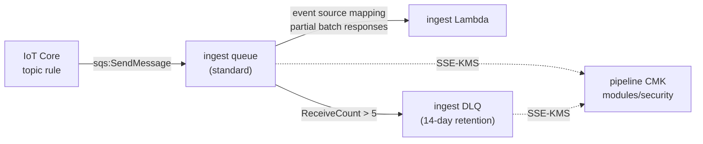

# modules/messaging

Standard SQS ingest queue and its dead-letter queue (DLQ): the buffer between
AWS IoT Core and the ingest Lambda. It absorbs bursts, retries transient
failures, and isolates messages that keep failing.

**Status:** code complete, not yet deployed. Static gate and runtime
verification pending (see [Verification](#verification)).

---

## Architecture



A message the handler reports as failed becomes visible again after the
visibility timeout. After more than `maxReceiveCount` (5) receives, SQS moves it
to the DLQ.

---

## Resources

| Resource | Purpose |
|---|---|
| `aws_sqs_queue.ingest` | Ingest queue: SSE-KMS, derived visibility timeout, 4-day retention |
| `aws_sqs_queue.dlq` | Dead-letter queue: SSE-KMS, 14-day retention |
| `aws_sqs_queue_redrive_policy.ingest` | Source side of the redrive contract: DLQ target + `maxReceiveCount` |
| `aws_sqs_queue_redrive_allow_policy.dlq` | DLQ side: only the ingest queue may use this DLQ (`byQueue`) |
| `aws_sqs_queue_policy.tls_only["ingest"]` | Denies every non-TLS request to the ingest queue |
| `aws_sqs_queue_policy.tls_only["dlq"]` | Denies every non-TLS request to the DLQ |

No resource-level tags: tagging is applied through the provider's
`default_tags` in the root module (ADR-0004).

---

## Design decisions
The retry contract below is recorded in ADR-0011.

### Standard queue, not FIFO
The IoT Core SQS rule action does not support FIFO queues. Ordering is not
required: persistence is idempotent through conditional writes, so duplicates
and reordering are harmless (ADR-0008).

### Visibility timeout is derived, not configured
`visibility_timeout = 6 × consumer_timeout_seconds + consumer_batching_window_seconds`,
following AWS Lambda guidance for SQS event sources. The headroom covers Lambda
retrying a batch while the function is throttled. A shorter timeout lets a
message reappear to a second poller while the first batch is still in flight,
causing duplicate processing and a `ReceiveCount` that climbs without any
handler failure, which can push healthy messages into the DLQ.

Deriving the value from the consumer's own settings (passed from shared root
locals) makes it impossible for a tfvars edit to break the invariant.

**Trade-off:** a transient failure waits one full visibility timeout before its
retry. With a 30 s function timeout that is 180 s per attempt. This matters for
alert latency and is an open decision (see [Open items](#open-items)).

### Retention: the DLQ must outlive the source
Standard queues keep a message's original enqueue timestamp when it moves to
the DLQ. If the DLQ retention were equal to or shorter than the source's, a
message could expire in the DLQ soon after arriving and the forensic evidence
would be lost silently.

| Queue | Retention | Rationale |
|---|---|---|
| ingest | 4 days | Survives a long-weekend consumer outage |
| DLQ | 14 days (service maximum) | At least 10 days of triage even for a message that arrived at the end of its source retention |

A `precondition` on the DLQ fails the plan if a future edit breaks
`dlq_retention > source_retention`.

### `maxReceiveCount = 5`
AWS recommends at least 5 for Lambda consumers, so transient failures get
several retries before landing in the DLQ.

### Encryption: SSE-KMS with the pipeline CMK
Both queues are encrypted with the single pipeline key (ADR-0010). No new key
policy statement is needed: producers and consumers call KMS with their own
credentials, which the key policy's `EnableIAMDelegation` statement covers.
With a CMK, reading a message requires both `sqs:ReceiveMessage` and
`kms:Decrypt`: two independent authorizations instead of one.

`kms_data_key_reuse_period_seconds` is set explicitly to the AWS default of
300 s, because it is the lever that trades KMS request volume against how long
a data key is reused.

### Redrive contract, both sides
`redrive_policy` on the source says where failed messages go.
`redrive_allow_policy` on the DLQ says who may send them there. The DLQ
default is `allowAll`: any queue in the account and Region could target it and
mix unrelated failures into PyroSense triage, and a later redrive could return
them to the wrong queue. `byQueue` restricts it to the ingest queue.

### The queue policy carries only a TLS Deny
Positive access is granted by identity policies on the IoT rule role and the
Lambda role, so each grant is reviewed next to the principal that uses it. The
resource policy is a guardrail no identity policy can override. SQS already
rejects non-HTTPS requests (`InvalidSecurity`); the Deny is defense in depth and
an explicit, scannable control.

---

## Usage

```hcl
locals {
  ingest_lambda_timeout_seconds  = 30
  ingest_batching_window_seconds = 0
}

module "messaging" {
  source = "./modules/messaging"

  name_prefix = local.name_prefix
  kms_key_arn = module.security.kms_key_arn

  consumer_timeout_seconds         = local.ingest_lambda_timeout_seconds
  consumer_batching_window_seconds = local.ingest_batching_window_seconds
}
```

Pass the same two locals to `module.ingest` so the queue and its consumer
cannot drift. With a batching window of 0, the event source mapping's batch
size must stay at or below 10.

---

## Inputs

| Name | Type | Required | Description |
|---|---|---|---|
| `name_prefix` | `string` | yes | Queue name prefix. 1–69 chars of `[A-Za-z0-9_-]`, so `<prefix>-ingest-dlq` fits the 80-char SQS limit. |
| `kms_key_arn` | `string` | yes | Pipeline CMK **key ARN** (not an alias or key id). IAM policies must name the full key ARN. |
| `consumer_timeout_seconds` | `number` | yes | Ingest Lambda timeout, integer 1–900. |
| `consumer_batching_window_seconds` | `number` | yes | Event source mapping batching window, integer 0–300. |
| `name_prefix` | `string` | yes | Queue name prefix. 1–64 chars of `[a-z0-9-]`, matching the root and `modules/security` naming contract. |

Retention, `maxReceiveCount` and the data key reuse period are `locals`, not
inputs: they are the same in demo and production (ADR-0002).

## Outputs

| Name | Consumer |
|---|---|
| `queue_arn` | `iot` (rule role policy), `ingest` (event source mapping, Lambda role) |
| `queue_url` | `iot` (SQS rule action), AWS CLI |
| `queue_name` | `observability` (CloudWatch `QueueName` dimension) |
| `dlq_arn` | Redrive tooling, triage |
| `dlq_url` | AWS CLI |
| `dlq_name` | `observability` (DLQ depth alarm) |

---

## IAM contract for other modules

This module grants no access. The roles that use the queues must carry these
permissions in their own identity policies, naming the full key ARN:

| Role | SQS | KMS |
|---|---|---|
| IoT rule role (producer) | `sqs:SendMessage` on `queue_arn` | `kms:GenerateDataKey`, `kms:Decrypt` |
| Ingest Lambda role (consumer) | `sqs:ReceiveMessage`, `sqs:DeleteMessage`, `sqs:GetQueueAttributes` on `queue_arn` | `kms:Decrypt` |

The producer needs `kms:Decrypt` too: when the data key reuse period expires,
`SendMessage` triggers a `Decrypt` call to verify the new data key.

---

## Cost

SQS request charges are not yet modeled for this module.

KMS requests are estimated with the AWS formula, per queue:

```
R = (billing_seconds / reuse_period) × (2 × producers + consumers)
```

Ingest queue, 1 producer and 1 consumer principal, 30 days of continuous
traffic, 300 s reuse period: `(2,592,000 / 300) × 3 = 25,920` requests/month.
That is the upper bound. Even if none of it fell within the account-wide KMS
free tier (20,000 requests/month), at $0.03 per 10,000 requests it would cost
about $0.08/month. The key's own $1/month is carried by `modules/security`.

---

## Verification

A green gate means the tools found nothing within their scope. The plan and the
deployed attributes are the evidence.

### Static
From the repository root, with the module referenced by `main.tf`:

```bash
terraform fmt -check -recursive
terraform init -backend-config=config/backend.hcl
terraform validate
tflint --recursive
trivy config . --tf-vars demo.tfvars   # read the log for parse errors, not only the table
```

### Plan

```bash
terraform plan -var-file=demo.tfvars -out=tfplan
terraform show -json tfplan > tfplan.json

# Exactly six managed resources in this module
jq -r '[.resource_changes[] | select(.module_address=="module.messaging" and .mode=="managed") | .address] | sort[]' tfplan.json

# Encryption, visibility timeout and retention per queue
jq '.resource_changes[] | select(.module_address=="module.messaging" and .type=="aws_sqs_queue")
    | {address, kms: .change.after.kms_master_key_id, kms_unknown: .change.after_unknown.kms_master_key_id,
       sse_sqs: .change.after.sqs_managed_sse_enabled, vt: .change.after.visibility_timeout_seconds,
       retention: .change.after.message_retention_seconds}' tfplan.json
```

Expected: the ingest queue has `vt` = 180 (with a 30 s timeout and a 0 s
window) and `retention` = 345600; the DLQ has `retention` = 1209600;
`sse_sqs` is never `true`. When `modules/security` is created in the same plan,
`kms` is `null` and `kms_unknown` is `true`.

### Runtime (after apply, before `module.ingest` consumes the queue)

```bash
Q=$(terraform output -raw ingest_queue_url)
D=$(terraform output -raw ingest_dlq_url)

# Attributes: KmsMasterKeyId, VisibilityTimeout, RedrivePolicy, Policy
aws sqs get-queue-attributes --queue-url "$Q" --attribute-names All
# Attributes: KmsMasterKeyId, RedriveAllowPolicy (byQueue + ingest queue ARN), Policy
aws sqs get-queue-attributes --queue-url "$D" --attribute-names All

# Redrive test, and the first runtime use of the pipeline key
aws sqs send-message --queue-url "$Q" --message-body '{"probe":"dlq-redrive"}'
for i in 1 2 3 4 5 6; do
  aws sqs receive-message --queue-url "$Q" --visibility-timeout 0 --wait-time-seconds 5 \
    --message-system-attribute-names ApproximateReceiveCount
done
aws sqs receive-message --queue-url "$D" --wait-time-seconds 10 \
  --message-system-attribute-names DeadLetterQueueSourceArn ApproximateReceiveCount

# Clean up the probe (deletion takes up to 60 s; purged messages are unrecoverable)
aws sqs purge-queue --queue-url "$D"
```

Expected: the probe appears in the DLQ, and its `DeadLetterQueueSourceArn`
equals `terraform output -raw ingest_queue_arn`.

---

## Open items

- **Permanent vs. transient failures: decided in ADR-0012.** Contract
  violations stay on the retry path and reach the DLQ after 5 attempts, so the
  DLQ mixes both classes. Never redrive it blindly: re-validate payloads first.
- **Alert latency vs. the 6× rule.** Each transient retry waits one visibility
  timeout. Revisit the function timeout against measured p99 `Duration` once
  `module.ingest` runs, and against an alert-latency SLO once one is defined.
- **IoT Core + CMK.** AWS documents that the rule must be able to use the key
  "on the caller's behalf". IAM permissions on the rule role are expected to
  suffice under `EnableIAMDelegation`; this is confirmed at runtime in
  `modules/iot`.

---

## References

- [Terraform `aws_sqs_queue`](https://registry.terraform.io/providers/hashicorp/aws/latest/docs/resources/sqs_queue)
- [Terraform `aws_sqs_queue_redrive_allow_policy`](https://registry.terraform.io/providers/hashicorp/aws/latest/docs/resources/sqs_queue_redrive_allow_policy)
- [Amazon SQS dead-letter queues](https://docs.aws.amazon.com/AWSSimpleQueueService/latest/SQSDeveloperGuide/sqs-dead-letter-queues.html)
- [Amazon SQS key management](https://docs.aws.amazon.com/AWSSimpleQueueService/latest/SQSDeveloperGuide/sqs-key-management.html)
- [SetQueueAttributes API](https://docs.aws.amazon.com/AWSSimpleQueueService/latest/APIReference/API_SetQueueAttributes.html)
- [Lambda: configuring an SQS event source](https://docs.aws.amazon.com/lambda/latest/dg/services-sqs-configure.html)
- [AWS IoT SQS rule action](https://docs.aws.amazon.com/iot/latest/developerguide/sqs-rule-action.html)
- [AWS KMS pricing](https://aws.amazon.com/kms/pricing/)
